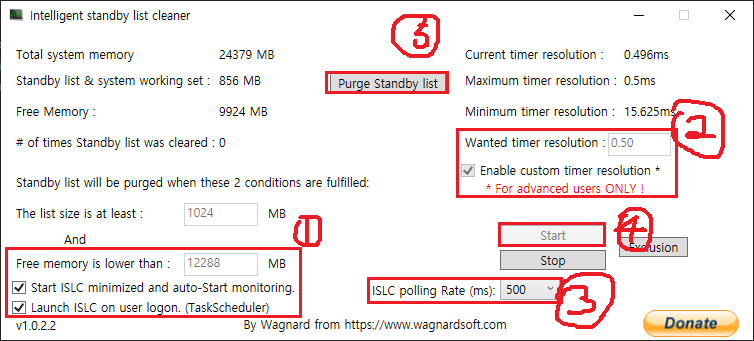

# PUBG Recoil, other settings

> [!NOTE]
> 모든 문의는 텔레그램 @shoon1012, 혹은 seunghoon.co.1@gmail.com 으로 연락 주세요.

> 이 문서는 한국어로 만들었습니다. 영어로 보고 싶으신 분들은 추후에 만들 예정이니, 시간을 갖고 기다려주시면 빠르게 만들도록 하겠습니다. 감사합니다.
> 또한, 그래픽 설정 같은 경우, 따라 하셔도 되고, 안따라 하셔도 됩니다. 이 그래픽 세팅 값은 제가 게임 했을떄 설정한 세팅 값이며, 성능이 현저히 떨어지시는 분들을 위한 세팅입니다.

## 목차

1. [배그 반동 세팅](#microsoft-visual-c-redistributable-packages)
2. [배그 그래픽 세팅](#배그-그래픽-세팅)
3. [ISLC](#ISLC)
4. [바이오스 세팅](#BIOS)

### 1. Microsoft Visual C++ Redistributable Packages

> [!IMPORTANT]
> 이 해당 버전을 다운로드 받을떄, 2005 패키지는 사용 되지 않습니다. 다만, 2005를 제외한 모든 버전은 모든 버전을 삭제하시고 진행하셔야 합니다.
추가로, 모든 프로그램의 버전에는, 지원 종료 날짜가 있습니다. 그 버전의 기한이 지나도 지장은 없으나, 혹여나 불편하신 분들은 따로 최신버전을 찾으셔서 별도로 설치 하셔야 합니다. 

> [!TIP]
> 93rk 님의 말에 따르면, Windows 11 Codec Pack을 설치하면 반동을 잡는 느낌이나, 반동을 제어할 때 화면에서 느껴지는 반응이 뭔가 다르게 느껴진다고 합니다.
반면, 이 글을 작성하고 있는 필자 본인의 경우에는 큰 차이를 체감하진 못했지만, 모든 사람이 똑같이 느끼는 건 아니기에, 혹시 궁금하다면 한 번쯤 설치해 보는 것도 나쁘지 않을 것 같습니다.

[x64](https://www.windows11codecpack.com/files/windows.11.codec.pack.v2.2.1.setup.exe) `Windows 11 Codec Pack`

#### Microsoft Visual C++ 2008 Redistributable Package
  * [x64](https://download.microsoft.com/download/5/D/8/5D8C65CB-C849-4025-8E95-C3966CAFD8AE/vcredist_x64.exe) *9.0.30729.6161 (EOL)* `Microsoft.VCRedist.2008.x64` 
  * [x86](https://download.microsoft.com/download/5/D/8/5D8C65CB-C849-4025-8E95-C3966CAFD8AE/vcredist_x86.exe) *9.0.30729.6161 (EOL)* `Microsoft.VCRedist.2008.x86`
#### Microsoft Visual C++ 2010 Redistributable Package
  * [x64](https://download.microsoft.com/download/E/E/0/EE05C9EF-A661-4D9E-BCE2-6961ECDF087F/vcredist_x64.exe) *10.0.40219.473 (EOL)* `Microsoft.VCRedist.2010.x64` 
  * [x86](https://download.microsoft.com/download/E/E/0/EE05C9EF-A661-4D9E-BCE2-6961ECDF087F/vcredist_x86.exe) *10.0.40219.473 (EOL)* `Microsoft.VCRedist.2010.x86`
#### Microsoft Visual C++ 2012 Redistributable Package
  * [x64](https://download.microsoft.com/download/1/6/B/16B06F60-3B20-4FF2-B699-5E9B7962F9AE/VSU_4/vcredist_x64.exe) *11.0.61030 (EOL)* `Microsoft.VCRedist.2012.x64` 
  * [x86](https://download.microsoft.com/download/1/6/B/16B06F60-3B20-4FF2-B699-5E9B7962F9AE/VSU_4/vcredist_x86.exe) *11.0.61030 (EOL)* `Microsoft.VCRedist.2012.x86`
#### Microsoft Visual C++ 2013 Redistributable Package
  * [x64](https://aka.ms/highdpimfc2013x64enu) *12.0.40664 (EOL)* `Microsoft.VCRedist.2013.x64`  
  * [x86](https://aka.ms/highdpimfc2013x86enu) *12.0.40664 (EOL)* `Microsoft.VCRedist.2013.x86` 
  * [x64](https://download.microsoft.com/download/b/4/6/b46720b7-1a9a-458a-8b07-633e6de4e760/vcredist_x64.exe) *12.l0.30501* (EOL) `Microsoft.VCRdist.2013.x64`
  * [x86](https://download.microsoft.com/download/2/E/6/2E61CFA4-993B-4DD4-91DA-3737CD5CD6E3/vcredist_x86.exe) *12.0.30501* (EOL) `Microsoft.VCRedist.2013.x86`
#### Microsoft Visual C++ 2015-2022 Redistributable Package
  * [x64](https://download.visualstudio.microsoft.com/download/pr/c7dac50a-e3e8-40f6-bbb2-9cc4e3dfcabe/1821577409C35B2B9505AC833E246376CC68A8262972100444010B57226F0940/VC_redist.x64.exe)* `Microsoft.VCRedist.2015+.x64`  
  * [x86](https://download.visualstudio.microsoft.com/download/pr/84c7705c-37c2-44cb-9454-c0aadea5661b/DD1A8BE03398367745A87A5E35BEBDAB00FDAD080CF42AF0C3F20802D08C25D4/VC_redist.x86.exe)* `Microsoft.VCRedist.2015+.x86`  

### 2. 배그 그래픽 세팅

따라 하셔도 되고, 안따라 하셔도 됩니다. 이 그래픽 세팅 값은 제가 게임 했을떄 설정한 세팅 값이며, 성능이 현저히 떨어지시는 분들을 위한 세팅입니다.

#### 전원 설정

* 키보드 중, 윈도우 키 누름 -> '전원 관리 옵션' 입력 후 Enter, 상단 경로에 전원 옵션 으로 클릭 및 이동 -> 전원 옵션을 고성능으로 바꾸기

#### Nvidia 전역 설정

* 그래픽 프로세서 -> 자신의 그래픽 카드로, 저지연 모드 -> 울트라(다만, 사양에 맞춰서, 켜기, 끄기 선택. 4060, 3070 이상은 울트라로 해도 무방), 텍스쳐 필터링 -> 고성능, PhysX -> GPU, 수직 동기화 -> 끄기, 삼중 버퍼링 -> 끄기, 사전 렌더 -> 1 or 3, 그 외의 것 -> 끄기 or 기본값

### 3. ISLC

#### ISLC (Intelligent Standby List Cleaner)란?

* ISLC는 Windows 시스템 메모리 최적화 도구로, 특히 게임 중 램 누수, 스탠바이 메모리 누적, 입력 지연(Input Lag) 등을 줄이기 위해 사용됩니다.

* Total System Memory = Free Memory is lower than
* The list size is at least = 가만히
* Wanted timer Resolution -> 0.5
* Start ISCminimized and auto-Start monitoring -> 체크
* Launch ISLC on user logon. (TaskScheduler) -> 체크

 
상세한 설명은 ISLC 치고, 구글 가보면 여러 설명이 나와있으니 참고하세요.
 

>[!CAUTION]
> 지금부터 나열하는 모든 항목은 따라 하실분만 따라 하는 항목입니다. 저는 아래에 나오는 항목대로 세텡하고 사용하였고, 각종 오류는 생기지 않았습니다. 하지만 몇몇분들은 블루스크린(그 이상은 오류 없음) 으로 초래할수도 있습니다. 그럴 경우 Free Memory is lower than 항목을 자신의 메모리의 절반으로 설정하시면 문제가 없습니다.
  

### 4. BIOS

* 따로 설명할 내용이 없습니다. 자신의 맞는 메인보드, 혹은 cpu의 모델명을 보시고, 그대로 인터넷에 치셔서 할수 있는 세팅들을 찾아보세요.