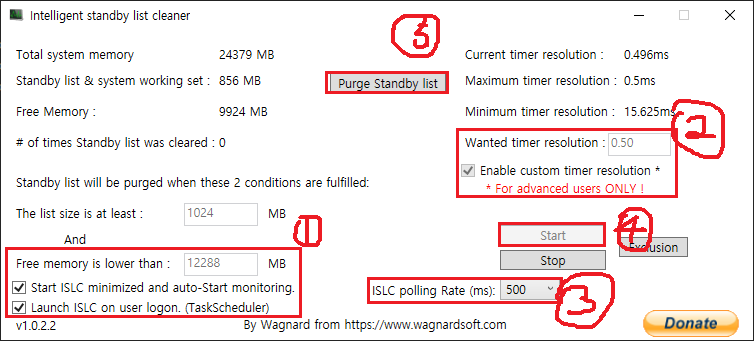

# PUBG Recoil and Other Optimization Settings

> [!NOTE]
> For any inquiries or if you need remote support, please contact via Telegram: @shoon1012, Email: seunghoon.no.1@gmail.com, or Discord: shoon_.04

 
> When receiving remote support, the support recipient (the one being assisted) is guaranteed that no personal information will be disclosed to anyone or anywhere. The recipient also has the full right to make requests or instructions to the remote supporter (or controller) during the session.
 
 
> This document was originally written in Korean. The graphics settings presented here are based on the author's personal setup and are intended to help those experiencing severe performance issues. Feel free to follow or modify them according to your needs.

## Table of Contents

1. [Microsoft Visual C++ Redistributables](#1-microsoft-visual-c-redistributable-packages-pubg-requirements)
2. [PUBG Graphics Settings](#2-pubg-graphics-settings)
3. [ISLC (Memory Optimization Tool)](#3-islc-memory-optimization-tool)
4. [BIOS Settings](#4-bios-settings)

---

### 1. Microsoft Visual C++ Redistributable Packages (PUBG Requirements)

> [!TIP] 
> Do not install the 2005 package. For all other versions, uninstall any existing versions before proceeding with installation.  
> Note that each version has an end-of-life (EOL) date. You may continue using them past that date, but if issues arise, please install the latest version manually.

> [!TIP]
> According to user 93rk, installing the Windows 11 Codec Pack made recoil control feel more responsive. While the author did not notice much difference, it may vary by user. It's worth trying out if you're curious.

[x64 Download](https://www.windows11codecpack.com/files/windows.11.codec.pack.v2.2.1.setup.exe) – **Windows 11 Codec Pack**  
> [!CAUTION] 
> Only download from the official link above or from [https://www.windows11codecpack.com](https://www.windows11codecpack.com). Installing from unofficial sites may include malware or adware.

* Click "Detailed install" and follow the steps in the image below:  

> ⚠ Be cautious: two ads may appear during installation. Make sure to decline them.

#### Microsoft Visual C++ Redistributable Downloads

- 2008:  
  * [x64](https://download.microsoft.com/download/5/D/8/5D8C65CB-C849-4025-8E95-C3966CAFD8AE/vcredist_x64.exe) `v9.0.30729.6161 (EOL)`  
  * [x86](https://download.microsoft.com/download/5/D/8/5D8C65CB-C849-4025-8E95-C3966CAFD8AE/vcredist_x86.exe) `v9.0.30729.6161 (EOL)`

- 2010:  
  * [x64](https://download.microsoft.com/download/E/E/0/EE05C9EF-A661-4D9E-BCE2-6961ECDF087F/vcredist_x64.exe) `v10.0.40219.473 (EOL)`  
  * [x86](https://download.microsoft.com/download/E/E/0/EE05C9EF-A661-4D9E-BCE2-6961ECDF087F/vcredist_x86.exe) `v10.0.40219.473 (EOL)`

- 2012:  
  * [x64](https://download.microsoft.com/download/1/6/B/16B06F60-3B20-4FF2-B699-5E9B7962F9AE/VSU_4/vcredist_x64.exe) `v11.0.61030 (EOL)`  
  * [x86](https://download.microsoft.com/download/1/6/B/16B06F60-3B20-4FF2-B699-5E9B7962F9AE/VSU_4/vcredist_x86.exe) `v11.0.61030 (EOL)`

- 2013:  
  * [x64](https://aka.ms/highdpimfc2013x64enu) `v12.0.40664 (EOL)`  
  * [x86](https://aka.ms/highdpimfc2013x86enu) `v12.0.40664 (EOL)`  
  * [x64](https://download.microsoft.com/download/b/4/6/b46720b7-1a9a-458a-8b07-633e6de4e760/vcredist_x64.exe) `v12.0.30501 (EOL)`  
  * [x86](https://download.microsoft.com/download/2/E/6/2E61CFA4-993B-4DD4-91DA-3737CD5CD6E3/vcredist_x86.exe) `v12.0.30501 (EOL)`

- 2015–2022:  
  * [x64](https://download.visualstudio.microsoft.com/download/pr/c7dac50a-e3e8-40f6-bbb2-9cc4e3dfcabe/VC_redist.x64.exe) `v14.42.34433`  
  * [x86](https://download.visualstudio.microsoft.com/download/pr/84c7705c-37c2-44cb-9454-c0aadea5661b/VC_redist.x86.exe) `v14.42.34433`

---

### 2. PUBG Graphics Settings

These settings are based on the author’s personal setup. You may follow or adjust based on your system.

#### Power Plan Settings

- Press the Windows key → search for "Power Options" → click and change the plan to **High Performance**

#### Nvidia Global Settings

- Preferred GPU → your discrete GPU  
- Low Latency Mode → Ultra (adjust depending on specs; Ultra is fine for RTX 4060, 3070 and up)  
- Texture Filtering → High Performance  
- PhysX → GPU  
- Vertical Sync → Off  
- Triple Buffering → Off  
- Pre-rendered Frames → 1 or 3  
- All other options → Default or Off

---

### 3. ISLC (Memory Optimization Tool)

#### What is ISLC?

ISLC (Intelligent Standby List Cleaner) is a memory optimization tool for Windows. It helps reduce RAM leaks, standby memory buildup, and input lag, especially useful during gaming.

> [!WARNING]
> Apply the following settings only if you understand the risks. The author uses these settings without issue, but some users have reported rare cases of BSOD. If that happens, try setting the "Free Memory is lower than" value to half your total system memory.

- Total System Memory = Free Memory is lower than  
- The list size is at least = Leave default  
- Wanted timer resolution → 0.5  
- Start ISLC minimized and auto-start monitoring → Check  
- Launch ISLC on user logon (via Task Scheduler) → Check

For more details, search for ISLC on Google and refer to community guides.

---

### 4. BIOS Settings

There is no one-size-fits-all setup. Please search for your specific motherboard or CPU model online to find optimal BIOS settings for performance or gaming.
